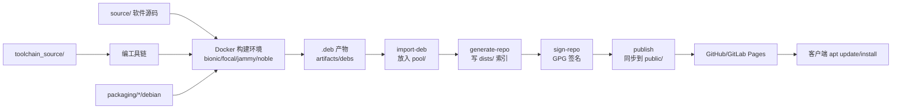

# 使用与原理说明

本文回答三件事：

1. **这些目录/脚本各自干什么**
2. **它们怎么配合**
3. **官方 APT 仓库的工作原理是什么**

看完后，你只需要按「日常怎么用」一节操作即可。

---

## 1. 一句话理解这个项目

你在维护一个**私有软件源**，形态和 Ubuntu 官方源一样：

- 真正的安装包（`.deb`）放在 `pool/`
- 目录索引（给 `apt` 读的清单）放在 `dists/`
- 用 GPG 给索引「盖章」（防别人偷偷改包列表）；详见 [2.3](#23-gpg-签名是什么通俗讲)
- 按 CPU 架构分开：`amd64`（常见 x86_64 电脑/服务器）和 `arm64`（ARM 机器）；详见 [2.4](#24-如何区分-x86-和-arm)
- 把整份仓库挂到 GitHub Pages / GitLab Pages（或任意静态网站）上
- 客户端写一行 `deb https://... jammy main`，就能 `apt install`

`source/` 和 `toolchain_source/` 是原料；其余目录是流水线、仓库和发布。

---

## 2. 官方 APT 怎么工作（原理）

### 2.1 客户端只认「规则拼出来的 URL」

你在客户端写：

```text
deb https://example.com/apt jammy main
```

含义是：

| 片段 | 含义 |
|------|------|
| `https://example.com/apt` | 仓库基址 |
| `jammy` | 套件（Suite / Codename），对应 Ubuntu 22.04 |
| `main` | 组件（Component） |

`apt update` **不会扫整个网站**，而是按固定规则去下载：

```text
https://example.com/apt/dists/jammy/InRelease
https://example.com/apt/dists/jammy/main/binary-amd64/Packages.gz
```

`apt install myapp` 时，再从索引里的 `Filename:` 字段去下载，例如：

```text
https://example.com/apt/pool/main/m/myapp/myapp_1.0.0~jammy1_amd64.deb
```

### 2.2 为什么要拆成 `dists/` 和 `pool/`

```text
仓库根/
├── dists/     ← 元数据（按系统版本分开）
│   ├── bionic/         Ubuntu 18.04
│   ├── focal/          Ubuntu 20.04
│   ├── jammy/          Ubuntu 22.04
│   └── noble/          Ubuntu 24.04
└── pool/      ← 所有 .deb 实体文件集中存放
```

- **不同系统要用不同编译产物**（依赖的 libc、库版本不同），所以 `bionic` / `focal` / `jammy` / `noble` 各有一套索引。
- **`.deb` 文件本身集中在 `pool/`**，索引用路径指过去，避免同一文件复制很多份。
- 本仓库为避免「同名同版本冲突」，会把版本写成 `1.0.0~jammy1`、`1.0.0~bionic1` 这种带套件后缀的形式。

### 2.3 GPG 签名是什么（通俗讲）

先忘掉术语，把它想成**防伪章**：

1. 你有一把**私钥**（锁在 `keys/gnupg/`，只有你能用）和一把**公钥**（发给所有人，文件如 `repo-key.gpg`）。
2. 每次生成完「包列表」后，用私钥在清单上盖一个章 → 得到 `InRelease`。
3. 用户机器上事先装了你的公钥。`apt update` 时会检查：这个章是不是你盖的？清单有没有被改过？
4. **只有私钥能盖出对得上公钥的章**。别人就算黑了你的网页、偷偷换成恶意 `.deb` 并改了包列表，没有私钥就盖不出有效章，`apt` 会拒绝更新。

所以这句话：

> 用 GPG 签名，证明索引没被篡改

意思是：**不是给每个软件加密**，而是给「仓库目录（Packages 列表）」做完整性与来源校验，防止中间人或服务器被篡改后用户还照样装包。

对应文件：

| 文件 | 角色 |
|------|------|
| `keys/gnupg/` | 私钥（保密，别提交到公开仓库） |
| `keys/repo-public.gpg` / `public/repo-key.gpg` | 公钥（给客户端安装） |
| `dists/<套件>/Release` | 本套件有哪些架构、组件，以及 Packages 的校验和 |
| `dists/<套件>/InRelease` | 带签名的 Release（客户端优先用这个） |

给用户的正规写法（先装公钥，再加源）：

```text
deb [signed-by=/usr/share/keyrings/linux-apt-repo.gpg] https://luhaikong2024.github.io/apt-repo jammy main
```

### 2.4 如何区分 x86 和 ARM

APT 里用的是 **Debian 架构名**，不是口头说的「x86 / ARM」：

| 你口头说的 | APT / 本仓库里的名字 | 常见机器 |
|------------|----------------------|----------|
| x86、x86_64、Intel/AMD 64 位 | **`amd64`** | 绝大多数台式机、笔记本、x86 服务器 |
| ARM 64 位 | **`arm64`**（别名 aarch64） | 树莓派 4/5、Apple Silicon 上的 Linux、许多 ARM 服务器/开发板 |
| 老旧 32 位 x86 | `i386`（本仓库默认不做） | 很少见了 |
| 老旧 32 位 ARM | `armhf`（本仓库默认不做） | 部分旧开发板 |

**怎么知道自己机器是哪种？** 在目标机器上执行：

```bash
dpkg --print-architecture
# 常见输出：amd64  或  arm64
```

**仓库里怎么区分？** 同一套件下按架构分目录和文件名（本仓库已按此建好路径）：

```text
dists/jammy/main/binary-amd64/Packages.gz   ← x86_64 机器读这个
dists/jammy/main/binary-arm64/Packages.gz   ← ARM64 机器读这个

pool/main/m/myapp/
  myapp_1.0.0~jammy1_amd64.deb              ← 给 amd64
  myapp_1.0.0~jammy1_arm64.deb              ← 给 arm64
```

**是的，`apt` 会自己找对应架构的包。** 你不必在 sources 里写 `binary-amd64` 这种路径。流程是：

1. 本机执行 `dpkg --print-architecture` 得到例如 `arm64`
2. `apt update` 自动请求：`dists/<套件>/main/binary-arm64/Packages.gz`
3. `apt install` 再按索引里的 `Filename:` 去 `pool/` 下载带 `_arm64.deb` 的文件

sources 里一行即可（套件用 `lsb_release -cs`，架构由 apt 自动选）：

```text
deb [signed-by=... arch=arm64] https://YOUR_URL jammy main
```

`arch=` 可选；写上可限制只拉该架构。不写时 apt 默认用本机架构。

**本项目里怎么配置：**

1. 在 `conf/repo.conf` 写上要支持的架构，例如只要 x86：

```bash
ARCHITECTURES="amd64"
```

或两个都要：

```bash
ARCHITECTURES="amd64 arm64"
```

2. 构建时指定架构（`A=`）：

```bash
make package S=jammy A=amd64    # 编 x86_64 包
make package S=jammy A=arm64    # 编 ARM64 包
```

注意：在 x86 电脑上直接编 `arm64` 包，通常需要交叉编译或在 ARM 机器 / `docker buildx` 多架构环境里编。当前脚本默认是在对应架构的容器里编；若你只有 x86 主机、又要出 ARM 包，需要额外准备交叉或远程 ARM 构建（可以后再加）。

三维可以记成：

```text
套件（系统版本） × 架构（CPU） × 组件（main）
例如：jammy + amd64 + main  →  一套索引 + 对应 .deb
```

### 2.5 和「简单扁平源」的差别

| | 官方布局（本项目） | 简单源 |
|--|--|--|
| sources 写法 | `deb URL jammy main` | `deb URL ./` |
| 索引位置 | `dists/<套件>/.../Packages.gz` | 和 `.deb` 放同一目录 |
| 包文件 | 集中在 `pool/` | 和索引放一起 |
| 多版本系统 | 多个套件目录 | 要自己再分子目录 |
| 多 CPU 架构 | `binary-amd64` / `binary-arm64` | 常靠目录名自己约定 |
| 签名 | `InRelease`（GPG 验章） | 常用 `[trusted=yes]` 跳过 |

---

## 3. 目录地图：每个文件夹是干什么的

```text
linux_apt_repo/
├── source/                 # 【你补充】软件源码
├── toolchain_source/       # 【你补充】编译工具链源码（可选）
├── packaging/              # Debian 打包说明（怎么把源码打成 .deb）
├── docker/                 # 各 Ubuntu 版本的构建容器
├── conf/                   # 仓库配置（支持哪些系统、包名等）
├── scripts/                # 自动化脚本（构建/导入/索引/签名/发布）
├── keys/                   # GPG 公钥；私钥在 keys/gnupg/（勿泄露）
├── repo/                   # 仓库工作区（dists + pool，构建后生成）
├── public/                 # 对外发布目录（给 Pages 用）
├── artifacts/              # 中间产物（编出来的 .deb、工具链包）
├── Makefile                # 常用命令的快捷入口
├── .github/workflows/      # GitHub Actions → Pages
├── .gitlab-ci.yml          # GitLab CI → Pages（可选）
├── README.md               # 简要说明
└── 使用与原理说明.md        # 本文件
```

### 你要改的 vs 脚本自动生成的

| 类型 | 路径 |
|------|------|
| **你放内容** | `source/`、`toolchain_source/` |
| **你常改配置** | `conf/repo.conf`、`packaging/myapp/debian/*` |
| **一般不用手改** | `repo/`、`public/`、`artifacts/`、`keys/gnupg/` |
| **理解后按需改** | `scripts/`、`docker/`、`.gitlab-ci.yml` |

---

## 4. 它们如何配合（整条流水线）

### 4.1 总览图



### 4.2 分阶段说明

**阶段 A：准备原料**

1. 把软件源码放进 `source/`
2. （可选）把工具链源码放进 `toolchain_source/`
3. 在 `conf/repo.conf` 里设好包名、版本、要支持的系统
4. 用模板生成/修改 `packaging/<包名>/debian/`（告诉系统如何打包）

**阶段 B：按系统版本编译**

对每个套件（如 jammy）启动对应 Docker 镜像：

- 容器里是「干净的 Ubuntu 22.04」
- 若已编过工具链，会挂载进容器
- 用 `dpkg-buildpackage` 打出 `.deb`
- 版本自动变成 `1.0.0~jammy1` 这种

为什么用 Docker？因为必须在 **目标系统同类环境** 里编译，否则装到用户机器上可能因库版本不兼容而跑不起来。

**阶段 C：做成官方仓库**

1. `import-deb.sh`：把 `.deb` 拷到 `repo/pool/main/.../`，并记录它属于哪个套件
2. `generate-repo.sh`：为每个套件生成 `Packages` / `Packages.gz`，再写 `Release`
3. `sign-repo.sh`：生成 `InRelease`、`Release.gpg`
4. `publish.sh`：把 `repo/dists`、`repo/pool` 和公钥拷到 `public/`

**阶段 D：客户端使用**

用户添加源 → `apt update` 拉索引 → `apt install` 按索引路径下包。

### 4.3 脚本分工（谁调用谁）

```text
make all
  └─ build-all.sh
       ├─ (可选) build-toolchain.sh   ← 读 toolchain_source/
       └─ build-package.sh            ← 读 source/ + packaging/ + docker/
            ├─ import-deb.sh          ← 写入 pool/ + .meta
            └─ generate-repo.sh
                 └─ sign-repo.sh      ← 用 keys/gnupg 签名

make publish
  └─ publish.sh                       ← repo/ → public/
```

单独常用命令：

| 命令 | 实际做的事 |
|------|------------|
| `make gpg` | 生成签名密钥 |
| `make bootstrap` | 从模板生成 `packaging/<包名>/debian` |
| `make toolchain S=jammy` | 只编工具链 |
| `make package S=jammy` | 编软件包并更新仓库索引 |
| `make repo` | 只根据已有 pool 重生成索引/签名 |
| `make publish` | 同步到 `public/` |
| `make all` | 全部套件构建 + 发布 |

---

## 5. 日常怎么用（按顺序做）

### 5.1 一次性准备（机器上做一次）

```bash
# 索引/签名工具
sudo apt-get install -y dpkg-dev apt-utils gnupg gzip xz-utils make

# 还需要 Docker（用于按 Ubuntu 版本构建）
```

```bash
cd /path/to/linux_apt_repo
make gpg          # 生成 GPG 密钥（已生成过可跳过）
make bootstrap    # 生成 packaging/myapp/debian（已有可跳过）
```

### 5.2 改配置

编辑 `conf/repo.conf`，至少关心这些：

```bash
PACKAGE_NAME="myapp"          # 包名，和 packaging/ 目录名一致
PACKAGE_VERSION="1.0.0"       # 上游版本号
SUITES="bionic focal jammy noble"  # 18.04～24.04
ARCHITECTURES="amd64"         # 架构：amd64=x86_64，arm64=ARM64；可写 "amd64 arm64"
```

### 5.3 放源码

**`source/`** 建议具备其一：

- `CMakeLists.txt`（默认打包规则最省事）
- 或 `Makefile` / `configure`
- 或根目录 `build.sh`（打包前会先执行）

**`toolchain_source/`**（可选）建议根目录有 `build.sh`：

```bash
#!/bin/sh
# 约定参数：--prefix 安装前缀  --out 输出目录
./build.sh --prefix /opt/custom-toolchain --out /out
```

也支持 CMake / configure / Makefile。

### 5.4 按需改打包元数据

主要看 `packaging/myapp/debian/`：

| 文件 | 作用 |
|------|------|
| `control` | 包名、依赖、简介 |
| `rules` | 怎么编译、怎么安装 |
| `changelog` | 版本记录（构建时会自动填版本/套件） |
| `install` | 哪些文件装到系统哪些路径 |

源码构建方式若和默认不一样，重点改 `rules`。

### 5.5 构建并发布

```bash
# 只编 Ubuntu 22.04
make package S=jammy

# 先编工具链再编软件（某个套件）
make toolchain S=jammy
make package S=jammy

# 配置里写的全部套件都编一遍，并发布到 public/
make all

# 带工具链的全量构建
./scripts/build-all.sh --with-toolchain
```

完成后检查：

```text
public/
├── dists/jammy/.../Packages.gz
├── pool/main/.../*.deb
├── repo-key.gpg
└── add-apt-source.sh
```

把 `public/` 作为网站根目录托管（GitHub Actions / GitLab CI 的 Pages 任务就是干这个）。

### 5.6 客户端添加源（正规流程）

第三方源需要先安装**你的公钥**，再写带 `signed-by` 的源：

```bash
curl -fsSL https://luhaikong2024.github.io/apt-repo/add-apt-source.sh \
  | sudo bash -s -- https://luhaikong2024.github.io/apt-repo
sudo apt install hello
```

手动步骤：

```bash
# 1. 公钥
curl -fsSL https://luhaikong2024.github.io/apt-repo/repo-key.gpg \
  | sudo tee /usr/share/keyrings/linux-apt-repo.gpg >/dev/null

# 2. 源
echo "deb [signed-by=/usr/share/keyrings/linux-apt-repo.gpg] https://luhaikong2024.github.io/apt-repo $(lsb_release -cs) main" \
  | sudo tee /etc/apt/sources.list.d/linux-apt-repo.list

# 3. 更新
sudo apt update
```

`$(lsb_release -cs)` 会变成 `jammy` / `noble` 等；apt 会按本机架构自动选包。

---

## 6. 关键文件再解释一遍

### `conf/repo.conf`

总开关：支持哪些系统、包名版本、是否签名、Docker 镜像名等。  
**改完后**，若只是改了 Origin 文案之类，跑 `make repo`；若套件列表变了，需要重新构建对应套件的包。

### `packaging/` 与 `packaging/templates/`

- `templates/`：母版
- `myapp/debian/`：当前包实际使用的打包文件（由 `make bootstrap` 从母版复制）

没有这份 `debian/` 元数据，就只有源码，系统不知道如何打成 `.deb`。

### `docker/Dockerfile.*`

- `Dockerfile.bionic` → Ubuntu 18.04 构建环境  
- `Dockerfile.focal` → 20.04  
- `Dockerfile.jammy` → 22.04  
- `Dockerfile.noble` → 24.04  

构建脚本会按套件选用对应镜像，保证「在 22.04 上编的包装给 22.04 用户」。

### `repo/` 与 `public/`

| 目录 | 角色 |
|------|------|
| `repo/` | 本地仓库工作区（含 `.meta` 记录哪个 deb 属于哪个套件） |
| `public/` | 对外只读镜像（去掉内部元数据，加上 `index.html`、公钥、客户端脚本） |

一般提交代码时不必提交 `repo/pool`、`public/dists` 等大产物（已在 `.gitignore`）；CI 会重新生成。

### `keys/`

- `repo-public.gpg`：公钥，给客户端用，可发布
- `keys/gnupg/`：**私钥**，只放构建机/CI 密钥变量里，不要推到公开仓库

### `.github/workflows/pages.yml`（GitHub）

推到 `main`/`master` 后自动：导入 `incoming/<套件>/*.deb` → 生成 `dists/`/`pool/` → 部署 GitHub Pages。  
正式地址：`https://luhaikong2024.github.io/apt-repo/`  
仓库 **Settings → Pages → Source** 选 **GitHub Actions**。  
正式发布务必配置 Secrets：`APT_REPO_GPG_PRIVATE_KEY`（固定签名钥匙；私钥只放 Secret，不要进仓库）。

### `.gitlab-ci.yml`（GitLab，可选）

流水线大致是：准备密钥 → 按套件构建 → 生成仓库 → 部署 Pages。  
源码还没放进去时，构建任务可能需要手动触发或等 `source/` 有变更。

---

## 7. 推荐的最小学习路径

1. 读本文第 2 节（官方原理）和第 4 节（配合关系）  
2. 打开 `conf/repo.conf`，改包名/版本  
3. 把一个能编译的最小项目放进 `source/`  
4. 执行：`make gpg && make package S=jammy && make publish`  
5. 看 `public/dists` 和 `public/pool` 是否出现文件  
6. 在一台 jammy 机器上按 5.6 加源试装  

工具链不是必须的：没有自定义编译器/SDK 时，可以暂时不管 `toolchain_source/`。

---

## 8. 常见问题

**Q: 为什么要为 focal / jammy / noble 各编一次？**  
A: 它们的系统库版本不同。一个 `.deb` 很难在所有 Ubuntu 上既合法又稳定地通用。

**Q: 只想支持 22.04 和 24.04？**  
A: 改 `conf/repo.conf`：

```bash
SUITES="jammy noble"
```

**Q: 包名不叫 myapp？**  
A: 改 `PACKAGE_NAME`，再 `make bootstrap`（或把 `packaging/myapp` 改名并改 debian 文件里的包名）。

**Q: 构建报 source/ 为空？**  
A: 还没放源码，或只有 `.gitkeep`。放入真实项目后再 `make package`。

**Q: 客户端 `apt update` 报签名错误？**  
A: 确认用的是当前仓库的 `repo-key.gpg`，且 CI/本地没有每次重新生成一把新密钥（生产环境应固定一把私钥，例如放进 CI 变量 `APT_REPO_GPG_PRIVATE_KEY`）。

**Q: `make package` 和 `make all` 有什么区别？**  
A: `package` 只编你指定的一个套件；`all` 按配置把所有套件编完并 `publish`。

---

## 9. 你只要记住的一条链

```text
源码(source) + 打包说明(packaging) + 系统环境(docker)
        ↓ 编译
      .deb
        ↓ 导入
      pool/（文件） + dists/（索引） + GPG（签名）
        ↓ 发布
      public/ → 网页托管
        ↓
   客户端: deb URL jammy main
```

这就是官方方案在本仓库里的完整用法与工作原理。
